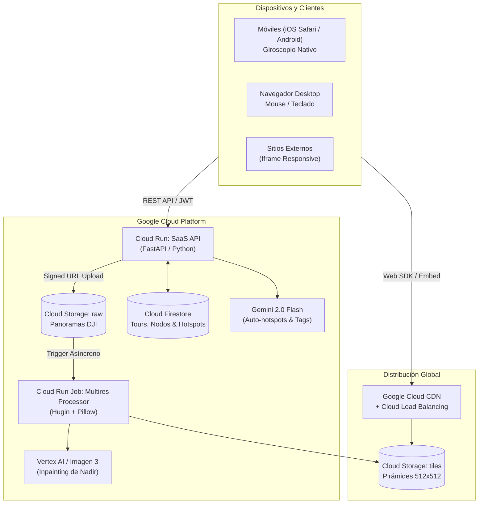

# 🚁 Andina Vision 360 - Cloud Platform & Virtual Tours

> **Plataforma Cloud-Native de Visualización 360° y Creación de Tours Virtuales para Drones DJI e Inmuebles, impulsada por Google Cloud Platform, Vertex AI, Google AI Studio, Google Stitch y Antigravity.**

[](https://github.com/brau450unab/andina-vision-360-platform)
[](https://cloud.google.com)
[](https://aistudio.google.com)
[](https://stitch.labs.google)

---

## 🌟 Visión General del Proyecto

Esta plataforma proporciona una solución desacoplada, sin ataduras a software privativo (como CloudPano, Kuula o Matterport) y con costo por uso real en Google Cloud (<$5 USD/mes), permitiendo:

1. **Landing Page Comercial Explicativa:** Con visor 360° en vivo que carga capturas reales de 8K Equirrectangulares, demostrando velocidad de 60 FPS, navegación inercial y cero colapsos de memoria en móviles.
2. **Biblioteca de Imágenes 360° (Acceso Cliente/Usuario):** Repositorio visual organizado por ambientes con metadatos técnicos, selector de calidad de imagen dinámica y visor modal a pantalla completa con giroscopio.
3. **Tour Studio & Editor Pro (Acceso Creador/Admin):** Interfaz para armar recorridos virtuales, colocar hotspots en la esfera con un solo clic, incrustar videos de YouTube 360 y enlaces a Google Drive, y asistido por herramientas generativas de **Vertex AI / Gemini Vision**.

---

## 🏗️ Arquitectura Técnica



---

## ⚡ Pilares del Motor 360°

- **Pirámides Multirresolución (Tile Pyramids):** Elude el límite de textura de 4096px impuesto por Apple en Safari iOS al fragmentar las capturas en mosaicos de 512×512 píxeles con niveles LOD.
- **Sensor de Giroscopio:** Compatible con la estricta API de permisos explícitos de iOS 13+ y equipado con puente `window.postMessage` para iframes de dominios cruzados.
- **Hotspots Multimedia:** Nodos direccionales 3D para saltar entre habitaciones y ventanas emergentes reactivas con videos de YouTube y carpetas de Google Drive.
- **Inteligencia Artificial Integrada:**
  - *Parcheo de Nadir:* Inpainting generativo con Imagen 3 para borrar trípodes y sombras de dron en el suelo.
  - *Sugerencia Espacial:* Detección de puntos de interés y redacción comercial con Gemini 2.0 Multimodal.

---

## 🔗 Integraciones de Google

| Herramienta | ID / Proyecto / Enlace | Función |
|---|---|---|
| **GitHub** | `brau450unab/andina-vision-360-platform` | Repositorio central de código y control de versiones |
| **Google Stitch** | `projects/3693078872688806056` | Sistema de diseño `"The Andean Horizon"` sincronizado |
| **Google AI Studio** | `Gemini 2.0 Flash` & `Imagen 3` | Experimentación de prompts, visiones multimodales y generación |
| **Google Cloud** | Cloud Run, Firestore, GCS, CDN | Infraestructura backend serverless escalable a 0 |
| **Antigravity** | Workspaces e IDE Agentic | Orquestación autónoma de código, pruebas y despliegue |

---

## 💻 Guía de Sincronización en Diferentes Computadores

### Opción 1: GitHub Codespaces / DevContainer (Recomendado para la Nube)
El repositorio incluye configuración de DevContainer en `.devcontainer/devcontainer.json`.
1. Abre el repositorio en [GitHub](https://github.com/brau450unab/andina-vision-360-platform).
2. Haz clic en el botón verde **Code** > pestaña **Codespaces** > **Create codespace on main**.
3. El entorno en la nube se configurará automáticamente con Node.js 20, Python 3.11 y Google Cloud SDK.

### Opción 2: Clonado Local en cualquier Computador
```bash
# 1. Clonar el repositorio
git clone https://github.com/brau450unab/andina-vision-360-platform.git
cd andina-vision-360-platform

# 2. Copiar variables de entorno
cp .env.example .env

# 3. Iniciar la Landing Page y Plataforma 360
cd ANDINA-VISION-Sitio-web
npm install
npm run dev
# Disponible en: http://localhost:3005
```

---

## 🛠️ Respaldo de Skills para Agentes Autónomos

El directorio [`.agents/skills/`](file:///.agents/skills/) almacena las directrices especializadas para ser invocadas por cualquier instancia de Antigravity o AI Studio:

- `3d-web-experience`: Optimización de escenas WebGL, Three.js y WebXR.
- `frontend-design`: Diseño de interfaces de alta gama.
- `high-end-visual-design`: Jerarquía visual, ritmo espacial y microinteracciones.
- `interactive-portfolio`: Narrativas interactivas de conversión.
- `magnific-ai`: Superresolución, textura fotográfica y upscaling para drones.
- `scroll-experience`: Experiencias cinemáticas guiadas por scroll.
- `ui-ux-pro-max`: Directrices integrales de experiencia de usuario.

---

## 📄 Licencia

Desarrollado para **Andina Vision**. Todos los derechos reservados © 2026.
